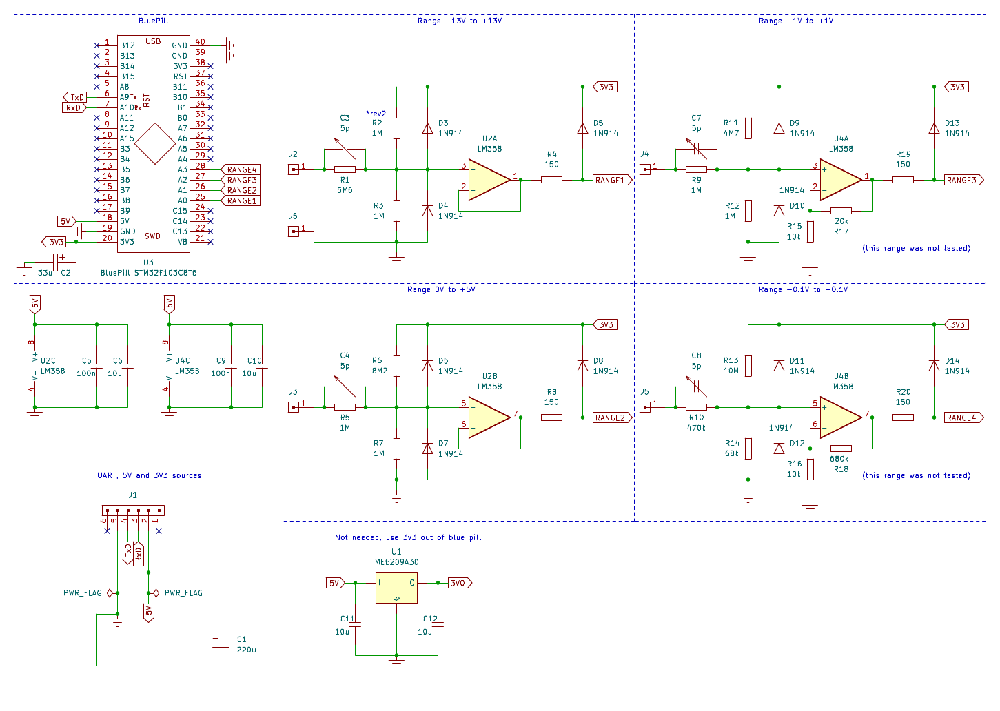

# arduino-blue-pill-scope
860kSPS USB scope made from Blue Pill using Arduino IDE

(this version have only first 2 voltage ranges populated)

I also made App in lazarus that interfaces the scope and shows curves:

# Revisions

1. First working 860kSPS DMA but dividers were unwisely plced on 5V rail which real world USB cables and 30mA of F103 pulled down to 4.6 and not in a nice consistent way, the noise was around 100mV, it was unusable.
2. Dividers moved to 3V3 rail which stabilized it, some resistor values needed to be adjusted to get output back into ADC range. Added app.

# Conclusion

It works, it's usable, it's more stable than DSO-138. If I were to make a PCB or version 2.0 I would choose STM variant that has separate analog ground and separate vref pin.